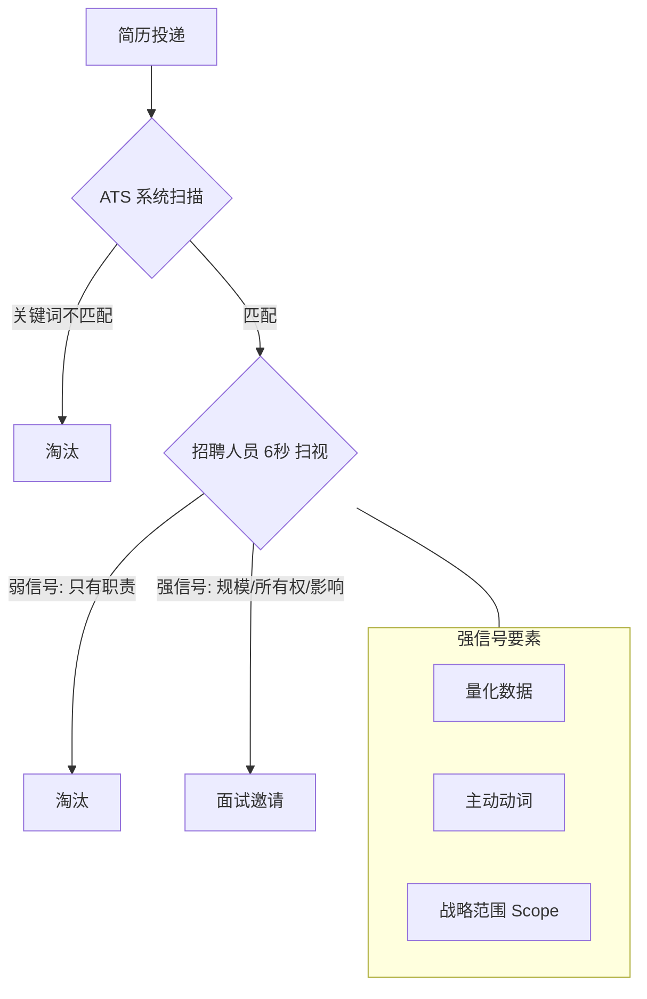

# 🎓 高端简历撰写全攻略：从“合格”到“卓越”的策略转换

### 核心哲学：为何优秀的候选人常被拒绝？
大多数精英候选人落选并非因为缺乏经验，而是因为**信号微弱 (Weak Signaling)**。在招聘者的视角中，如果 10 秒内无法看到以下三个维度，简历就会被淘汰：
1.  **规模 (Scope)**：你的工作影响范围有多大？
2.  **所有权 (Ownership)**：哪些关键决策是你驱动的？
3.  **业务影响力 (Business Impact)**：因为你的存在，业务发生了什么具体的、正向的改变？

---

## 第一部分：全能型优化法则 (The Universal Fix)

*   **剔除平庸**：删掉所有通用的、描述职责的子弹点（Bullets）。
*   **数据为王**：在任何可能的地方添加量化指标和数据。
*   **逻辑闭环**：每一项描述必须遵循“**主动动词 + 结果导向 (Action + Outcome)**”的公式。

---

## 第二部分：七大核心简历场景策略 (AI 驱动提示词库)

### 1. ATS(机器人) + 人类友好的完美简历
*   **专家设定**：10年+资深招聘专家。
*   **核心逻辑**：6 秒内抓住注意力，自然融入关键词。
*   **视觉禁忌**：禁止使用表格、图标、图形（确保 ATS 兼容）。
*   **结构要求**：强有力的“职业总结”开头 + 清晰、可量化的成就导向（不超过1-2页）。

### 2. 高管简历 (管理者/负责人/高级职位)
*   **语气定位**：自信、低调但有力。
*   **核心指标**：管理团队规模、预算规模、决策权、对公司/产品的战略贡献（扩展、增长、优化）。

### 3. 初级/职业起步简历
*   **核心逻辑**：将“经验有限”转化为“潜力无限”。
*   **强化维度**：实习、自由职业、学校项目，重点突出可迁移能力 (Transferable Skills) 与学习速度。

### 4. 单页超强简历 (初创/科技/快节奏职位)
*   **二八原则**：专注展示最强的 20% 成就，删除所有多余内容。
*   **优先级排序**：最强成就 > 最相关经验 > 最关键技能（目标：10秒定生死）。

### 5. 跨平台转换 (LinkedIn 转简历)
*   **策略**：将 LinkedIn 的简介与经验转化为专业的、符合 ATS 格式的简历文本。

### 6. 简历批判与风险评估
*   **严苛视角**：模拟“严厉但公平”的招聘专家进行自检。
*   **审查清单**：优点、弱点、**淘汰风险**、改进建议及优化的句子示例。

### 7. 基于 JD (职位描述) 的精准打击
*   **策略**：100% 匹配。提取 JD 中的最关键关键词，用 JD 的语言重新改写你的经历。

---

## 第三部分：实战案例研究--从“执行制片人”到“行业操盘手”

以 **Eric-Zheng** 的简历优化为例，展示如何将“常规经验”硬核化、高端化。

### 核心定位：复合型顶尖人才
*   **差异化竞争点**：不仅是执行制片，更是罕见的、能同时驾驭“欧洲顶级艺术电影跨国法务/技术/融资”与“中国顶尖大厂S级CG动画商业制作”的复合型制片人。

### 1. 作品经历的“硬核化”重塑 (以《家庭简史》为例)
不能只写“制片人”，必须拆解为以下四个深度维度：

#### A. 国际创投与顶级基金操盘 (International Financing)
*   **关键词**：双料入围、圣丹斯、柏林电影节、世界剧情片竞赛单元。
*   **量化战绩**：成功申请并操盘多项全球顶级基金：
    *   **CNC** (法国国家电影中心) 世界电影基金。
    *   **Ile-de-France** (巴黎大区电影基金)：获批约 **11.5万欧元**。
    *   **DFI** (多哈电影学院) 后期基金。
    *   **TFL** (都灵电影工作坊) 联合制片大奖：**5万欧元**。
    *   **Richard Vague Fund** (纽约大学基金)。

#### B. 深度国际法务与版权交付 (Legal & Delivery)
*   **关键词**：复杂版权纠纷、国际销售代理、法国发行方。
*   **具体细节**：全权负责与 **Films Boutique** (国际销售) 和 **Tandem Films** (法国发行) 的法务对接，展现处理跨国商业协议的专业深度。

---

## 第四部分：简历扫描逻辑视图

---
*整理自：AI 探路者 Tim & 专家简历点评稿 (2026-03-24)*